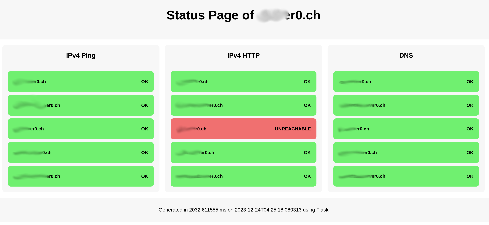

# Status Page for Homelab
This is the source code for my simple status website built using Flask.
Upon visiting the site, the Flask app makes a few simple queries to see
which services are online.

## TODO
 - [x] Basic functionality
 - [x] Config file instead of hard-coded domains
 - [ ] Config file instead of hard-coded queries
 - [ ] Add more informative text instead of "OK" and "UNREACHABLE"
 - [ ] IPv6 things

## Development
For local development, use
~~~
flask --app statuspage run
~~~

## Deployment
See the [Flask documentation](https://flask.palletsprojects.com/en/latest/deploying/nginx/)
for more information. I use Apache with simple CGI because there is no
(performance) reason to set up FastCGI or similar.

Provide a `config.json` with your domains:
~~~
{
    "domains" : ["example.com", "localhost"],
    "hostname" : "foo.bar"
}
~~~

Configure your webserver with CGI to run the script. Make sure to not expose
unwanted files (`.git`, `__pycache__`).

## Issues
If you run into issues using ping, make sure capabalities for normal users
are set:

~~~
setcap cap_net_raw+p /bin/ping
~~~
